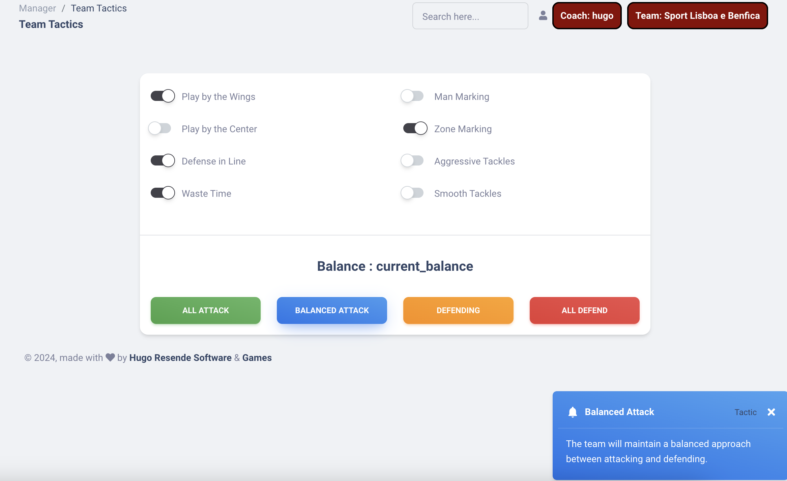

### Champions Manager 2024
- This is a classic football manager

- run the project
1. composer install
2. php artisan serve
---------------------------------
- seeding database : 
1. php artisan queue:work 
2. php artisan db:seed
- diagram url : https://app.diagrams.net/?src=about#G14OsjvK-3zLhVncOVNSaG_1xltPP0VDAt#%7B%22pageId%22%3A%22hF73AjS4VcjZSjbr9od7%22%7D

